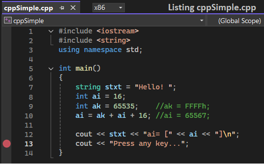
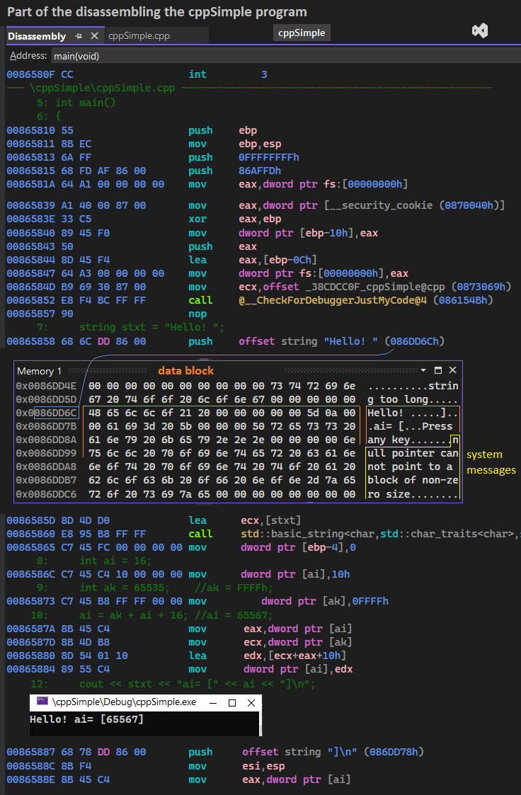
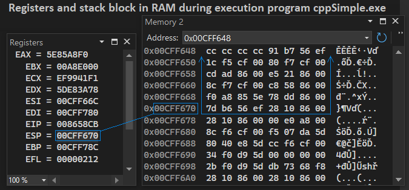
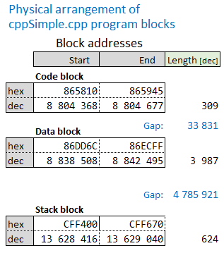
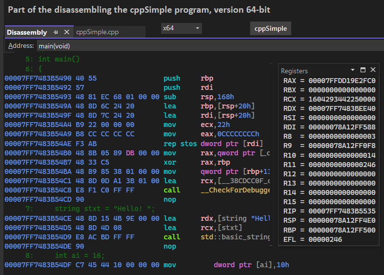
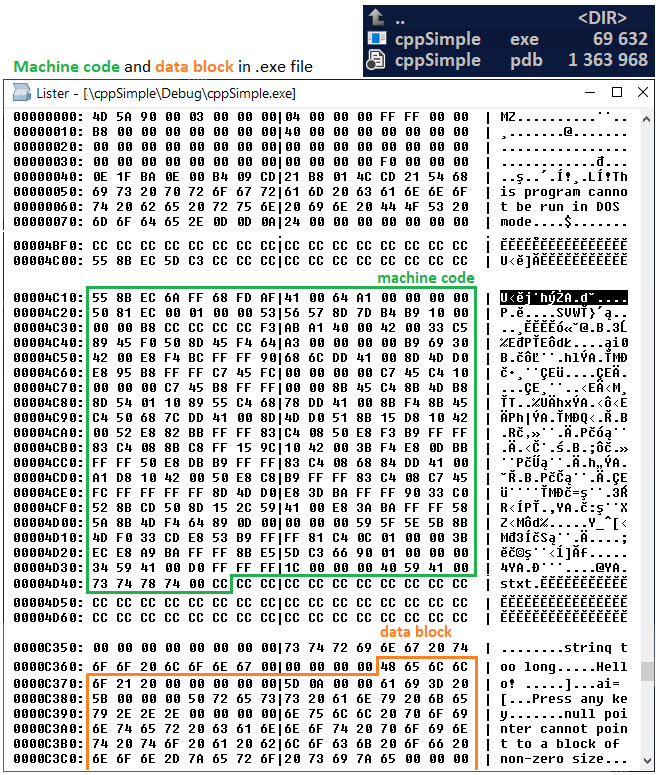

-----------

# High-level language C++ (PE format)

## Need for high-level languages
Previously analyzed was the assembler program Masm_simple.asm (Fig.P21), which displays a text message on the screen. This is done by a single command [call _WriteConsoleA@20], and a dozen other commands merely prepare data, addresses, and regroup registers. This makes the assembly code convoluted and unreadable, the logic of the operation can be easily lost.

Therefore, it would be better to have a mechanism where only one line would be a print command, and tidy operations, register matching, assembler and machine code generation would even be hidden from the programmer but ultimately work.
This is the idea behind high-level languages. We type, for example, the command [cout << “Press any key...”;] and the low-level mechanism will itself generate the necessary assembler to output a message on the screen: “Press any key...”. The programmer may not even know that an assembler exists, and the program will work for him. He can then focus on the logic of the program minimizing the number of instructions and not get into the intricacies of the processor.

## C++ language
That's why almost at the very beginning of computer science came the C language, later C++, which works according to the principle described above.

In this chapter we will look at the operation of such a sample program cppSimple.
Here is its simple code:

 
Fig.C1 Listing ‘cppSimple.cpp’

Lines 7,8,9 create variables stxt, ai, ak and assign them values from literals. The programmer does not have to worry about how to put them in the data block - the compiler itself will do it.
In line 10 the action is executed, the next 2 lines print messages on the screen. 
The decimal numeric value ai is displayed. The programmer does not worry, as in assembler, how to convert it - the C++ compiler does it implicitly.
In line 13, the debugger stops running so that you can look at the program's distribution in RAM, which the WIN10 system has done.

The debugger listing contains the file [Diassembly.txt], below is part of the assembly code that the C++ compiler generated.

 
Fig.C2 Disassembling program ‘cppSimple.cpp’ in RAM 

From 6 lines of code in C++, the compiler generated 101 assembler instructions. In the first 20 instructions the preparation of the environment is in progress, from address 0865858h variables and further instructions are loaded.
4 instructions from address 086587Ah perform addition: ai = ak + ai + 16. Several registers and memory space are used. So a simple-looking addition is actually spread over several instructions of the processor. Further operations are even more complicated.

 
Fig.C3 Registers and stack block in RAM ‘cppSimple.cpp’

 
Fig.C4 Physical arrangement of programs block

## 64-bit version
Fig.C5 shows the beginning of the assembler when the program was run in 64-bit mode. Of course, there must be a physical 64-bit processor for this and this is its standard mode. It has more registers here, as you can see, and almost every register is 64-bit. Also the addressing is 64-bit. For the processor, the modes can be changed. In the previous 32-bit mode, the processor extracts 32-bit registers and uses only 32-bit lines, although physically it has 64 lines connected.

 
Fig.C5 Disassembling program, version 64-bit

## Universality of high-level languages.
In an assembler program, e.g. Masm_simple.asm, assembler instructions for a specific processor were written directly. If you changed the mode in the same processor to 64-bit the program would no longer work. Even more so if you changed the type of processor - the program would not work.
Meanwhile, in C++ there is no such danger - the same program can run on many different processors when the compiler covers a given processor.
So there are high-level languages very convenient, safe and universal.
In C++ you can also write assembler inserts when a key procedure needs to run extremely fast. Then the assembler will allow the fastest path of operation.

## Creating an .exe program in C++
Similar to the assembler - the C++ compiler generates an .exe file from a .cpp text file:

- 1 The compiler creates assembler code .asm;
- 2 Compiler creates machine code and and data block from assembler;
- 3 Compiler creates an intermediate .obj file containing all or part of the target program;
- 4 Linker creates an executable .exe file by linking .obj sources (may be libraries) that contain the created machine code and data blocks;

## Running .exe programs

- 5 The operating system runs an .exe file by:
a) Rewriting machine code from the .exe file to RAM;
b) Rewriting a block of data from the .exe file to RAM;
c) Reserving the stack block;
d) Updating absolute jump addresses and data addresses;
e) Running the program - jumping to the first machine code instruction;
f) Execution of the program by the processor (subsequent instructions);

Quite importantly, the .exe file contains compiled machine code ready for use.
Fig.C6 shows excerpts from the contents of the exe file. The machine code to be executed is marked in the green box. It is 310 bytes long and is copied exactly into RAM. This copy is updated by the system with addresses (long jumps, data), because, after all, the compiler does not know where in RAM the machine code will be located. Therefore, in the .obj files there is information which addresses need to be modified and the system modifies them before running the program.

 
Fig.C6 Machine code in .exe file

## Target machine code in the exe file
The important thing, however, is that the program code from the .exe file is no longer compiled () just directly suitable for quick use.
Much more complex is the .exe program from .NET, because there a special intermediate environment works, which 'on the fly' performs the target compilation.
In C++, as you can see, there is no intermediate element, and it is worth emphasizing this to capture the way programs work.

## This chapter is part of the main project

This chapter is part of the <a href="https://github.com/janluksoft/NET_MainComparison">NET Main Comparison project</a>:  
"Comparison of software development methods from low-level methods to .NET".

The next chapter is:
<a href="https://github.com/janluksoft/NET_Types">Data types in .NET</a>
